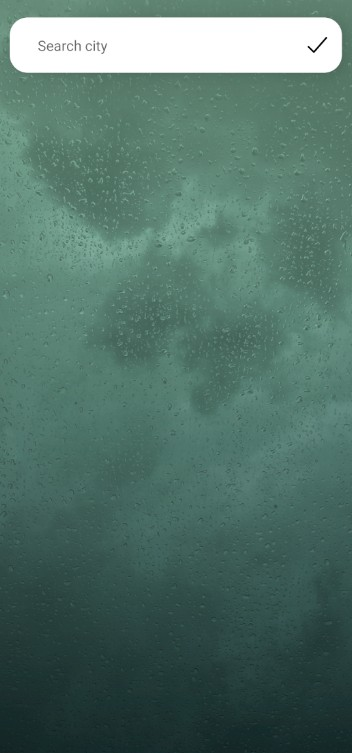
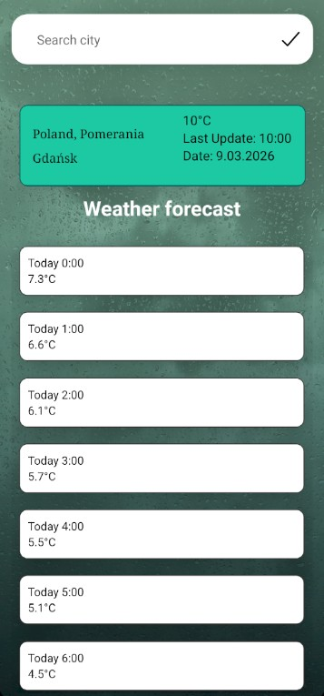

# Weather-app

A mobile application built with React Native that provides real-time weather information using the Open-Meteo API.
It allows the users to check the current weather for their location or any other city.

## Features
- View weather (i.e Temperature, Last Update, Time)
- Search by cities
- 7-day forecast

## Tech Stack
- React Native
- Expo
- JavaScript
- Open-Meteo API

## Screenshots
### Main Page
Main Page of the app. There is a searchbar which allows the user to check the weather forecast by
entering the name of the city.

  

### Forecast
After entering the city the user will see on top of the page weather card with basic informations
like country, region, last weather update time. Underneath the weather card a forecast for the upcoming 7 days will
render displaying the temperature, hour and day.

  

## Author
Andrzej Nowak
GitHub: https://github.com/NowakAndrzej283

## License
MIT License
